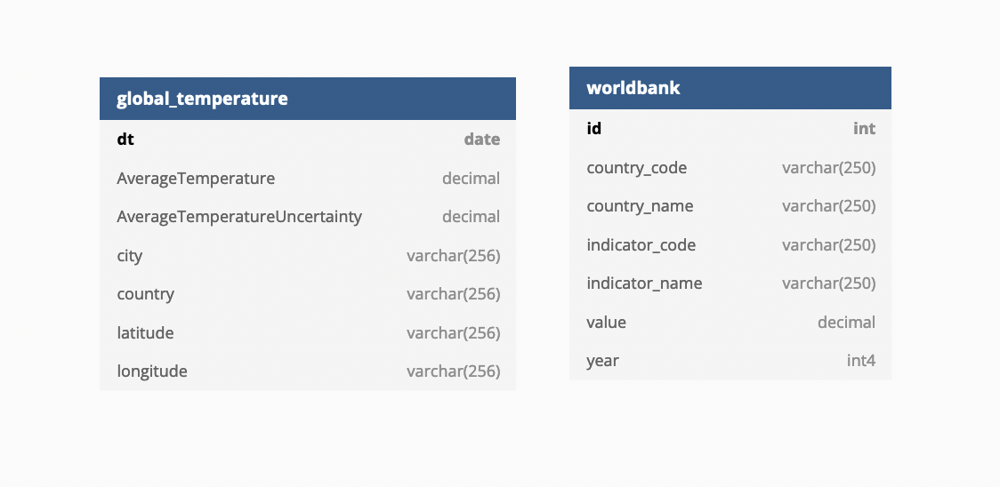

# Climate Change with World Bank Data Analysis Pipeline

**Table of Contents**

* [Project Overview](#project-overview)
* [Datasets](#datasets)
* [Data Modeling](#data-modeling)
* [Data Dictionary](#data-dictionary)
* [Data Quality Checks](#data-quality-checks)
* [Technologies](#technologies)
* [Future Design Considerations](#future-design-considerations)
* [Files and What They Do](#files-and-what-they-do)
* [Instruction on Running the Project](#instruction-on-running-the-project)


## Project Overview

This project builds an automated ETL/ELT data pipeline. It aims to create
a star schema optimized for queries on climate change with world bank country
profile data analysis. We extract data from S3, process the data using Spark,
save them in Parquet back into S3. Spark process is deployed on a cluster using
AWS. At the end, we use the data stored in S3, stage them in Redshift, and
transform them into a set of dimensional tables for further analysis.

## Datasets

* [Climate Change: Earth Surface Temperature Data](https://www.kaggle.com/datasets/berkeleyearth/climate-change-earth-surface-temperature-data)
* [World Bank Country Profile](https://public.opendatasoft.com/explore/dataset/worldbank-country-profile/table/?disjunctive.country_name&disjunctive.indicator_name&sort=-year)

## Data Modeling

In this project, we'll have two data models as show in the figure below.



The data model diagram is created by [dbdiagram.io](https://dbdiagram.io/).

We can use an SQL query to address business questions that provide insights
into important decisions. For example, if we want to see if the change of the
land temperature has any impact on the indicators in Thailand or not, we can
query like this:

```sql
SELECT
  g.country,
  EXTRACT(YEAR FROM g.dt) AS year,
  AVG(g.AverageTemperature) AS average_temperature,
  AVG(g.AverageTemperatureUncertainty) AS average_temperature_uncertainty,
  w.indicator_name AS indicator_name,
  AVG(w.value) AS indicator_value
FROM
  global_temperature g
JOIN
  worldbank w
ON
  EXTRACT(YEAR FROM g.dt) = g.year
  AND g.country = w.country_name
WHERE
  g.country = "Thailand"
GROUP BY
  g.country,
  EXTRACT(YEAR FROM g.dt),
  w.indicator_name
```

Here is a part of the result from the query above:

| country | year | average_temperature | average_temperature_uncertainty | indicator_name | indicator_value |
| - | - | - | - | - | - |
| ... |
| Thailand | 2012 | 28.48466 | 0.344408 | Employment to population ratio, ages 15-24, male (%) (modeled ILO estimate) | 53.51 |
| Thailand | 2012 | 28.48466 | 0.344408 | Out-of-pocket expenditure per capita (current US$) | 27.71143723 |
| Thailand | 2013 | 29.07528 | 0.442128 | Labor force participation rate for ages 15-24, total (%) (modeled ILO estimate) | 43.39 |
| Thailand | 2013 | 29.07528 | 0.442128 | Labor force participation rate for ages 15-24, female (%) (modeled ILO estimate) | 34.21 |
| Thailand | 2013 | 29.07528 | 0.442128 | Unemployment, youth male (% of male labor force ages 15-24) (modeled ILO estimate) | 0.91 |
| ... |

## Data Dictionary

### Global Temperature

| Name | Type | Description |
| - | - | - |
| dt | date | Date (as primary key) |
| AverageTemperature | decimal | Average land temperature in celsius |
| AverageTemperatureUncertainty | decimal | The 95% confidence interval around the average  |
| city | varchar(256) | City |
| country | varchar(256) | Country |
| latitude | varchar(256) | Latitude of the city |
| longitude | varchar(256) | Longitude of the city |

### World Bank Country Profile

| Name | Type | Description |
| - | - | - |
| id | int | ID (as primary key) |
| country_code | varchar(256) | Country code |
| country_name | varchar(256) | Country name |
| indicator_code | varchar(256) | Indicator code |
| indicator_name | varchar(256) | Indicator name |
| value | decimal | Value of the indicator |
| year | int | Year |

## Data Quality Checks

To ensure the data quality, we'll run the data quality checks to make sure that

* Column `dt` in table `global_temperature` should *not* have NULL values
* Column `AverageTemperature` in table `global_temperature` should *not* have values greater than 100
* Table `worldbank` should have records
* Column `value` in table `worldbank` should *not* have NULL values

## Technologies

* Apache Airflow for orchestrating workflow
* Amazon EMR (Spark) for large data processing
* Amazon S3 for data storage
* Amazon Redshift for data warehousing and analysis

## Future Design Considerations

* The data was increased by 100x.

  In this project, we have already used Amazon EMR, which is a  cloud big data
  platform for running large-scale distributed data processing jobs. This means
  we can scale our cluster up to add the processing power when the job gets too
  slow.

  We could store the data in Parquet format instead of CSV to save disk space
  and cost. We can also partition the data by date or country, which depends on
  how we query the data to answer business questions.

* The data populates a dashboard that must be updated on a daily basis by 7am every day.

  Here using Apache Airflow can be very useful since we can schedule our
  workflow to update the data used by a dashboard on a daily basis.

* The database needed to be accessed by 100+ people.

  Amazon Redshift can handle the connections up to 500 connections by default.

## Files and What They Do

| Name | Description |
| - | - |
| `mnt/dags/climate_change_with_worldbank_data_pipeline.py` | An Airflow DAG file that runs the ETL data pipeline on climate change and world bank profile data |
| `mnt/plugins/` | An Airflow plugin folder that contains customer operators used in this project |
| `spark/app/global_temperature_data_processing.py` | A Spark app that reads the global temperature data from CSV, runs ETL, and saves data in Parquet |
| `spark/app/worldbank_data_processing.py` | A Spark app that reads the world bank country profile data from JSON, runs ETL, and saves data in Parquet |
| `create_tables.sql` | A SQL script to create tables |
| `.env.local` | A environment file that contains the environment variables we want to override in `docker-compose.yaml` and `docker-compose-spark.yaml` |
| `Dockerfile` | A Dockerfile that contains the instruction how to build an Airflow instance with Amazon EMR provider installed |
| `docker-compose.yaml` | A Docker Compose file that runs an Airflow instance with Amazon EMR provider installed used in this project |
| `Dockerfile-spark` | A Dockerfile that contains the instruction how to build an Airflow instance with Apache Spark provider installed |
| `docker-compose-spark.yaml` | A Docker Compose file that runs an Airflow instance with Apache Spark provider installed |
| `setup.cfg` | A configuration file for Flake8 |
| `README.md` | README file that provides discussion on this project |

## Instruction on Running the Project

Running Airflow on local machine:

```sh
cp .env.local .env
echo -e "AIRFLOW_UID=$(id -u)" >> .env
mkdir -p mnt/dags mnt/logs mnt/plugins
docker-compose build
docker-compose up
```
