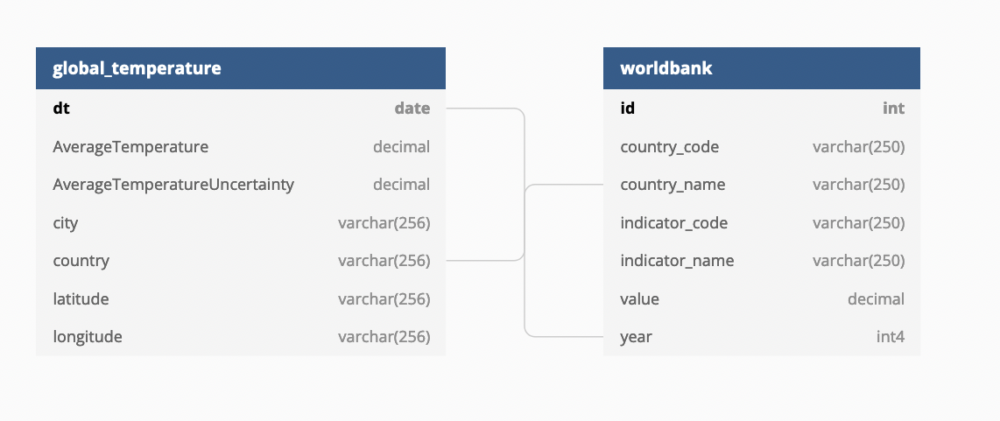

# Climate Change with World Bank Data Analysis Pipeline

## Project Overview

This projects builds an automated ETL/ELT data data pipeline. It aims to create a star schema optimized for queries on climate change with world bank country profile data analysis. We extract data from S3, process the data using Spark, save them in Parquet back into S3. Spark process is deployed on a cluster using AWS. At the end, we use the data stored in S3, stage them in Redshift, and transform them into a set of dimensional tables for further analysis.

### Technologies

* Apache Airflow for orchestrating workflow
* Amazon EMR (Spark) for large data processing
* Amazon S3 for data storage
* Amazon Redshift for data warehousing and analysis

### Data Modeling

In this project, we'll have two data models as show in the figure below.



The data model diagram is created by [dbdiagram.io](https://dbdiagram.io/).

### Future Design Considerations

* The data was increased by 100x.

  In this project, we have already used Amazon EMR, which is a  cloud big data platform for running large-scale distributed data processing jobs. This means we can scale our cluster up to add the processing power when the job gets too slow.

  We could store the data in Parquet format instead of CSV to save disk space and cost. We can also partition the data by date or country, which depends on how we query the data to answer business questions.

* The data populates a dashboard that must be updated on a daily basis by 7am every day.

  Here using Apache Airflow can be very useful since we can schedule our workflow to update the data used by a dashboard on a daily basis.

* The database needed to be accessed by 100+ people.

  Amazon Redshift can handle the connections up to 500 connections by default.

## Datasets

* [Climate Change: Earth Surface Temperature Data](https://www.kaggle.com/datasets/berkeleyearth/climate-change-earth-surface-temperature-data)
* [World Bank Country Profile](https://public.opendatasoft.com/explore/dataset/worldbank-country-profile/table/?disjunctive.country_name&disjunctive.indicator_name&sort=-year)

## Files and What They Do

| Name | Description |
| - | - |
| `mnt/dags/climate_change_with_worldbank_data_pipeline.py` | An Airflow DAG file that runs the ETL data pipeline on climate change and world bank profile data |
| `mnt/plugins/` | An Airflow plugin folder that contains customer operators used in this project |
| `spark/app/global_temperature_data_processing.py` | A Spark app that reads the global temperature data from CSV, runs ETL, and saves data in Parquet |
| `spark/app/worldbank_data_processing.py` | A Spark app that reads the world bank country profile data from JSON, runs ETL, and saves data in Parquet |
| `create_tables.sql` | A SQL script to create tables |
| `.env.local` | A environment file that contains the environment variables we want to override in `docker-compose.yaml` and `docker-compose-spark.yaml` |
| `Dockerfile` | A Dockerfile that contains the instruction how to build an Airflow instance with Amazon EMR provider installed |
| `docker-compose.yaml` | A Docker Compose file that runs an Airflow instance with Amazon EMR provider installed used in this project |
| `Dockerfile-spark` | A Dockerfile that contains the instruction how to build an Airflow instance with Apache Spark provider installed |
| `docker-compose-spark.yaml` | A Docker Compose file that runs an Airflow instance with Apache Spark provider installed |
| `setup.cfg` | A configuration file for Flake8 |
| `README.md` | README file that provides discussion on this project |

## Instruction on Running the Project

Running Airflow on local machine:

```sh
cp .env.local .env
echo -e "AIRFLOW_UID=$(id -u)" >> .env
mkdir -p mnt/dags mnt/logs mnt/plugins
docker-compose build
docker-compose up
```
