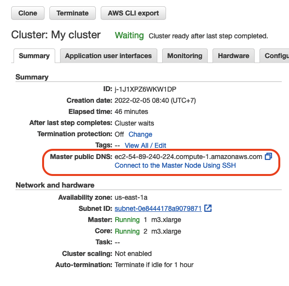

# Song Play Analysis

## Project Overview

This projects builds an ETL pipeline for a data lake hosted on S3. It loads data from S3, processes the data into analytics tables using Spark, and loads them back into S3. Spark process is deployed on a cluster using AWS.

## Database Schema

The ER diagram (created by [dbdiagram.io](https://dbdiagram.io/)) below shows the
Sparkify database schema design with the tables and the columns.


Here we have the fact table:

* `songplays`

and the dimension tables:

* `users`
* `songs`
* `time`
* `artists`

We can use an SQL query to address business questions that provide insights into
important decisions. For example, if we want to know the 5 most popular songs, we 
can query like this:

```sql
WITH songplays_count AS (
    SELECT
      song_id, 
      count(1)
    FROM songplays
    GROUP BY song_id
)
SELECT
  songplays_count.song_id,
  songs.title,
  count
FROM songplays_count
JOIN songs
  ON songplays_count.song_id = songs.song_id
ORDER BY songplays_count.count DESC
LIMIT 5;
```

## Files and What They Do

| Name | Description |
| - | - |
| `dl.cfg` | A configuration file that contains AWS credentials |
| `etl.py` | A Python script that loads data from S3, processes the data into analytics tables using Spark, and loads them back into S3. This is the ETL script. |
| `etl_local.ipynb` | A Jupyter notebook file that contains the code to use Spark to run the ETL process on local machine. This is for testing purpose. |
| `README.md` | README file that provides discussion on this project |
| `docker-compose.yaml` | A Docker Compose file that runs a Jupyter notebook with PySpark installed used in this project |
| `pyproject.toml` | A file that contains Python package dependencies managed by Poetry for this code repository |
| `setup.cfg` | A configuration file for Flake8 |


## Instruction on Running the ETL script

1. SSH to the master node on the cluster.

    

1. Copy these two files to the cluster.
    1. `etl.py`
    2. `dl.cfg`
1. Configure the AWS credentials in `dl.cfg`
1. Run the script:

    ```bash
    spark-submit etl.py
    ```

## Instruction on Running the Jupyter Notebook (Testing Purpose)

Here I set up the Docker Compose to run a Jupyter notebook with Spark installed; therefore, we can run the ETL script on local machine. This makes it easier to test. To start the notebook, run:

```bash
docker-compose up
```

### Formatting Code

This project uses the [Poetry](https://python-poetry.org/) for managing Python dependencies.
Kindly go to the website and install it first. After that, please follow the steps below.

1. Install the dependencies.

    ```bash
    poetry install
    ```

1. Format the code using Black:

    ```bash
    poetry run black .
    ```

1. Run static analysis using Flake8:

    ```bash
    poetry run flake8 .
    ```

To clean up the project, run:

```bash
docker-compose down
```
