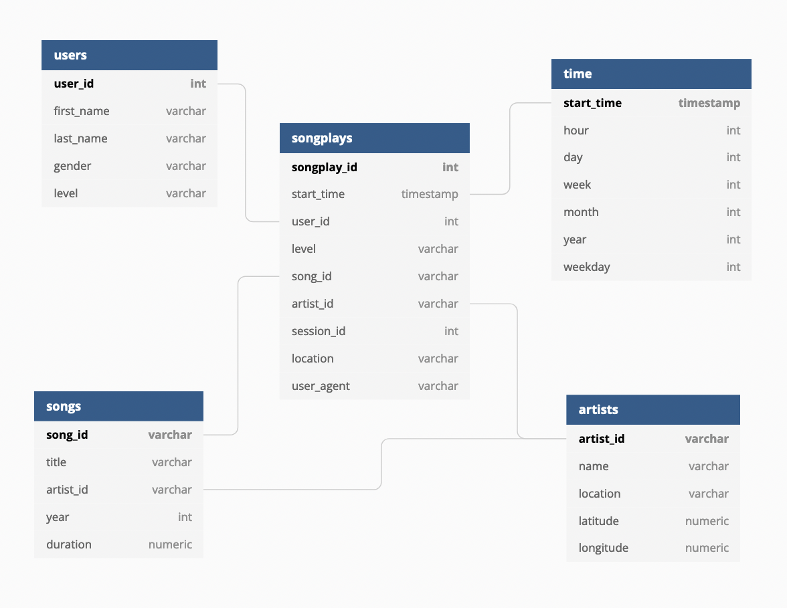

# Song Play Analysis

## Project Overview

This project defines the fact and dimension tables for a star schema for a song play
analysis, and write an ETL pipeline to transform data from files and load into the
tables in Postgres using Python and SQL.

In this project, we're interested in understanding what songs users are listening to.

## Database Schema

The ER diagram (created by [dbdiagram.io](https://dbdiagram.io/)) below shows the
Sparkify database schema design with the tables and the columns.



Here we have the fact table:

* `songplays`

and the dimension tables:

* `users`
* `songs`
* `time`
* `artists`

We can use an SQL query to address business questions that provide insights into
important decisions. For example, if we want to know the 5 most popular songs, we 
can query like this:

```sql
WITH songplays_count AS (
    SELECT
      song_id, 
      count(1)
    FROM songplays
    GROUP BY song_id
)
SELECT
  songplays_count.song_id,
  songs.title,
  count
FROM songplays_count
JOIN songs
  ON songplays_count.song_id = songs.song_id
ORDER BY songplays_count.count DESC
LIMIT 5;
```

## Files and What They Do

| Name | Description |
| - | - |
| `sql_queries.py` | A Python script that contains all SQL queries and is imported into other files |
| `create_table.py` | A Python script that drops and creates the tables. We can run this file to reset our tables before each time we run the ETL script |
| `etl.py` | A Python script that reads and processes files from `song_data` and `log_data` and loads them into the tables. This is the ETL script. |
| `test.ipynb` | A Jupyter notebook file that displays the first few rows of each table to let us check our database |
| `etl.ipynb` | A Jupyter notebook file that contains detailed instructions on the ETL process for each of the tables |
| `README.md` | README file that provides discussion on this project |
| `docker-compose.yaml` | A Docker Compose file that runs a Postgres database used in this project |
| `pyproject.toml` | A file that contains Python package dependencies managed by Poetry for this code repository |
| `setup.cfg` | A configuration file for Flake8 and Pytest |

## Instruction on Running the Python Scripts

Before we start running the ETL process, we'll need to run the Postgres database first.
Here I set up the Docker Compose for it. To start the Postgres, run:

```bash
docker-compose up -d
```

This project uses the [Poetry](https://python-poetry.org/) for managing Python dependencies.
Kindly go to the website and install it first. After that, please follow the steps below.

1. Install the dependencies.

    ```bash
    poetry install
    ```

1. Initialize all of the tables.

    ```bash
    poetry run python create_tables.py
    ```

    We can use the command above to refresh the database as well.

1. Then we perform the ETL process.

    ```bash
    poetry run python etl.py
    ```

1. Finally, check data qualty by running:

    ```bash
    poetry run pytest -v
    ```

To clean up the project, run:

```bash
docker-compose down
```
